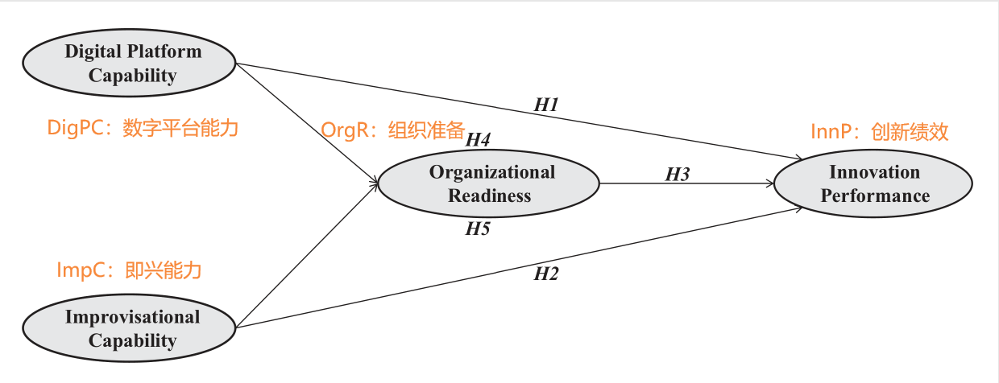

```{r setup, include=FALSE}
knitr::opts_chunk$set(
  echo       = TRUE,
  message    = FALSE,
  warning    = FALSE,
  out.width  = "100%",
  fig.asp    = 0.618, 
  fig.show   = "hold",
  fig.pos    = "center",
  fig.align  = "center",
  dpi        = 600
)

options(
  digits = 3,
  knitr.table.format = "html"
)
```


```{r, message=FALSE, warning=FALSE, echo = FALSE}
library(tidyverse)
theme_set(bayesplot::theme_default(base_size = 14))
```


## 核心概念架构图


```{r, message=FALSE, warning=FALSE, echo=FALSE}
library(tidyverse)
rawdf <- readr::read_rds("./data/rawdf.rds")
```


```{r, echo=FALSE}

```


---
class: middle, center


# 问题一：如何检验量表信效度？


---


## 构建模型：宏包lavaan你值得拥有！
```{r}
library(lavaan) # latent variable analysis

model <- '
   DigPC =~ DigPC1 + DigPC2 + DigPC3 + DigPC4 + DigPC5 + DigPC6 + DigPC7
   ImpC  =~ ImpC1 + ImpC2 + ImpC3 + ImpC4 + ImpC5 + ImpC6 + ImpC7 + ImpC8 + ImpC9 + ImpC10 + ImpC11 + ImpC12
   OrgR  =~ OrgR1 + OrgR2 + OrgR3 + OrgR4
   InnP  =~ InnP1 + InnP2 + InnP3 + InnP4 + InnP5
'

fit_cfa <- cfa(model = model, data = rawdf)
```


---
## 获取结果
```{r}
Cronbach_Alpha <- semTools::reliability(fit_cfa)[1, ]
CR             <- semTools::compRelSEM(fit_cfa)
AVE            <- semTools::AVE(fit_cfa)

df_ACA <- tibble(
  Details = names(CR),
  Alpha   = Cronbach_Alpha,
  CR      = CR,
  AVE     = AVE
)
```


---


## Table1: 信效度检验


.pull-left[


```{r, results='hide'}
order <- c("DigPC", "DigPC1", "DigPC2", "DigPC3", "DigPC4", "DigPC5", "DigPC6", "DigPC7", "ImpC", "ImpC1", "ImpC2", "ImpC3", "ImpC4", "ImpC5", "ImpC6", "ImpC7", "ImpC8", "ImpC9", "ImpC10", "ImpC11", "ImpC12", "OrgR", "OrgR1", "OrgR2", "OrgR3", "OrgR4", "InnP", "InnP1", "InnP2", "InnP3", "InnP4", "InnP5")

fit_cfa |> 
  parameterEstimates(standardized = TRUE) |> 
  filter(op == "=~") |> 
  select(Details = rhs, F.L = std.all, t.value = z) |> 
  add_row(tibble(Details = c("DigPC", "ImpC", "OrgR", "InnP")), .before = 1) |> 
  left_join(df_ACA, by = join_by(Details)) |> 
  arrange(factor(Details, levels = order)) |> 
  flextable::flextable()
```


]
.pull-right[

```{r, echo=FALSE}
order <- c("DigPC", "DigPC1", "DigPC2", "DigPC3", "DigPC4", "DigPC5", "DigPC6", "DigPC7", "ImpC", "ImpC1", "ImpC2", "ImpC3", "ImpC4", "ImpC5", "ImpC6", "ImpC7", "ImpC8", "ImpC9", "ImpC10", "ImpC11", "ImpC12", "OrgR", "OrgR1", "OrgR2", "OrgR3", "OrgR4", "InnP", "InnP1", "InnP2", "InnP3", "InnP4", "InnP5")

fit_cfa |> 
  parameterEstimates(standardized = TRUE) |> 
  filter(op == "=~") |> 
  select(Details = rhs, F.L = std.all, t.value = z) |> 
  add_row(tibble(Details = c("DigPC", "ImpC", "OrgR", "InnP")), .before = 1) |> 
  left_join(df_ACA, by = join_by(Details)) |> 
  arrange(factor(Details, levels = order)) |> 
  flextable::flextable()
```


]


---
class: middle, center


# 问题二：如何选择最佳模型？


---


3因子一阶模型
```{r}
model <- '
   DigPC =~ DigPC1 + DigPC2 + DigPC3 + DigPC4 + DigPC5 + DigPC6 + DigPC7
   ImpC  =~ ImpC1 + ImpC2 + ImpC3 + ImpC4 + ImpC5 + ImpC6 + ImpC7 + ImpC8 + ImpC9 + ImpC10 + ImpC11 + ImpC12
   OrgR  =~ OrgR1 + OrgR2 + OrgR3 + OrgR4
'
fit_cfa3 <- cfa(model = model, data = rawdf)
```


2因子一阶模型
```{r}
model <- '
   DigPC =~ DigPC1 + DigPC2 + DigPC3 + DigPC4 + DigPC5 + DigPC6 + DigPC7
   ImpC  =~ ImpC1 + ImpC2 + ImpC3 + ImpC4 + ImpC5 + ImpC6 + ImpC7 + ImpC8 + ImpC9 + ImpC10 + ImpC11 + ImpC12
'
fit_cfa2 <- cfa(model = model, data = rawdf)
```


单因子一阶模型
```{r}
model <- '
  DigPC =~ DigPC1 + DigPC2 + DigPC3 + DigPC4 + DigPC5 + DigPC6 + DigPC7
'
fit_cfa1 <- cfa(model = model, data = rawdf)

```


---


## Table2：模型比较
```{r}
library(lavaanExtra)
list(fit_cfa, fit_cfa3, fit_cfa2, fit_cfa1) %>% 
  nice_fit(nice_table = TRUE) %>% 
  flextable::align(align = "center", part = "body")
```


---
class: middle, center


# 问题三：你真的了解潜变量吗？


---


## 潜变量的相关系数
```{r}
df_correlation <- fit_cfa %>% 
  lavInspect(what = "cor.lv") %>% # lavaan yyds!
  as.data.frame() %>% 
  rownames_to_column(var = "Variable")
```

```{r, echo=FALSE}
df_correlation |> 
  flextable::flextable() |> 
  flextable::autofit()
```


---
## 潜变量的均值和方差
```{r}
df <- rawdf |> rowwise() |> 
  transmute(
    DigPC = mean(c(DigPC1, DigPC2, DigPC3, DigPC4, DigPC5, DigPC6, DigPC7)),
    ImpC  = mean(c(ImpC1, ImpC2, ImpC3, ImpC4, ImpC5, ImpC6, ImpC7, ImpC8, ImpC9, ImpC10, ImpC11, ImpC12)),
    OrgR  = mean(c(OrgR1, OrgR2, OrgR3, OrgR4)),
    InnP  = mean(c(InnP1, InnP2, InnP3, InnP4, InnP5))
  ) |> ungroup()
df |> 
  summarise(across(everything(), list(Mean = mean, SD = sd))) |> 
  pivot_longer(
    cols = everything(),
    names_to = c("Variable", ".value"),
    names_pattern = "(.*)_(Mean|SD)"
  ) |> flextable::flextable() |> flextable::autofit()
```


---


## Table3：潜变量的均值、方差和相关系数


.pull-left[


```{r, results='hide'}
df |> 
  summarise(
    across(everything(), list(Mean = mean, SD = sd))
  ) |> 
  pivot_longer(
    cols = everything(),
    names_to = c("Variable", ".value"),
    names_pattern = "(.*)_(Mean|SD)"
  ) |> 
  left_join(
    df_ACA |> select(Details, Alpha),
    by = join_by("Variable" == "Details")
  ) |> 
  left_join(
    df_correlation,
    by = join_by("Variable")
  ) |>  
  flextable::flextable() |>  
  flextable::autofit()
```


]


.pull-right[


<br>
<br>
<br>
<br>
```{r, echo=FALSE}
df |> 
  summarise(
    across(everything(), list(Mean = mean, SD = sd))
  ) |> 
  pivot_longer(
    cols = everything(),
    names_to = c("Variable", ".value"),
    names_pattern = "(.*)_(Mean|SD)"
  ) |> 
  left_join(
    df_ACA |> select(Details, Alpha),
    by = join_by("Variable" == "Details")
  ) |> 
  left_join(
    df_correlation,
    by = join_by("Variable")
  ) |>  
  flextable::flextable() |>  
  flextable::autofit()
```


]
---
class: middle, center


# 问题四：潜变量之间的路径系数——中介模型


---

## 构建中介模型
```{r}
model <- '
  DigPC =~ DigPC1 + DigPC2 + DigPC3 + DigPC4 + DigPC5 + DigPC6 + DigPC7
  ImpC  =~ ImpC1 + ImpC2 + ImpC3 + ImpC4 + ImpC5 + ImpC6 + ImpC7 + ImpC8 + ImpC9 + ImpC10 + ImpC11 + ImpC12
  OrgR  =~ OrgR1 + OrgR2 + OrgR3 + OrgR4
  InnP  =~ InnP1 + InnP2 + InnP3 + InnP4 + InnP5
  
  OrgR ~ a1 * DigPC + a2 * ImpC
  InnP ~ b * OrgR + cprime1 * DigPC + cprime2 * ImpC
  
  c1         := cprime1 + a1 * b
  c2         := cprime2 + a2 * b
'

fit_med <- sem(model, data = rawdf)
```


---


## Table4：直接效应
```{r}
fit_med |> 
  parameterEstimates(standardized = TRUE) |> 
  filter(op == "~") |>
  filter(label %in% c("cprime1", "cprime2", "b")) |> 
  select(!lhs:rhs) |> 
  mutate(
    label = case_match(
      label,
      "cprime1" ~ "DigPC → Innp",
      "cprime2" ~ "Impc  → Innp",
      "b"       ~ "OrgR  → Innp"
    )
  ) |> 
  flextable::flextable() |>  
  flextable::colformat_double(digits = 4) |>  
  flextable::autofit() 
```


---


## Table5：间接效应
```{r}
fit_med |> 
  parameterEstimates(standardized = TRUE) |> 
  filter(op == ":=") |> 
  filter(label == "c1") |> 
  select(!lhs:rhs) |> 
  mutate(label = "DPC → OR → IP") |> 
  flextable::flextable() |> 
  flextable::colformat_double(digits = 4) |> 
  flextable::autofit()
```


---
## Table6：间接效应
```{r}
fit_med |> 
  parameterEstimates(standardized = TRUE) |> 
  filter(op == ":=") |>  
  filter(label == "c2") |> 
  select(!lhs:rhs) |> 
  mutate(label = "IC → OR → IP") |> 
  flextable::flextable() |> 
  flextable::colformat_double(digits = 4) |> 
  flextable::autofit()
```

