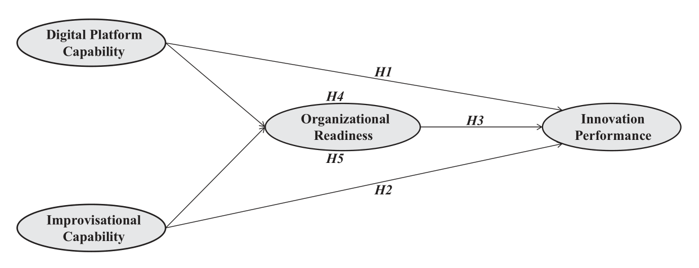

```{r setup, include=FALSE}
knitr::opts_chunk$set(
    echo      = FALSE,
    warning   = FALSE, 
    message   = FALSE,
    out.width = "85%",
    fig.asp   = 0.618,
    fig.align = 'center',
    fig.pos   = "H", 
    out.extra = "",
    dpi       = 600
)
options(digits = 3)
```


# Introduction

The notion of “digital economy” has attained vast scholarly attention in this decade. The business sector is increasingly adapting information technology (IT) and associated with newest technologies, resulting in emergence of digital economy[@Weichselbaumer2012]. Hence, the role of IT in businesses is critical in digital economy for achieving innovation. Digital economy contributes6.9% to the United States(US)gross domestic product(GDP), 6%to China’s GDP and 4.5% of the global GDP[@Ryan1996]. These statistics show that businesses need digital technologies and instant innovation performance to contribute to digital economy. Innovation performance has become critical success factor for almost every organization of current digital era. The use of Electronic word-of-mouth (eWOM), Internet of Things (IoT), cloud computing, big data, artificial intelligence (AI) and robotics are opening new corridors for businesses to shape innovation performance in an effective manner. The current debate on innovation performance shows that innovation performance is concerned with both individual and organizational level factors. But all these studies have been conducted to explore factors affecting innovation performance other than digital economy.


# Literature review

## Digital platform capability and innovation performance
DPC refers to the ability to stay connected with business world through online market places or communication channels which permits prompt and low-cost scaling. Digital platforms provide useful information in a form of forecasting, production information and customer trends[@Ryan1996].


## Organization’s improvisational capability and innovation performance
Organizational improvisation capability refers to the firm’s ability to instinctively reconfigure existing resources to develop new operational skills to cope critical, unpredictable and newest environmental issues. It is the degree of concentration and overlaps of planning and execution the required strategies to address dynamic situations[@Weichselbaumer2012].


# Hypothesis development

H1. Digital platform capability has a positive influence on innovation performance.

H2. Organization’s improvisational capability has a positive influence on innovation performance.

H3. Organizational readiness positively affects innovation performance

H4. Organizational readiness mediates the link between digital platform capability-innovation performance

H5. Organizational readiness mediates between organization’s improvisational capability and innovation performance link.


To sum up, the hypotheses model is depicted in Fig \@ref(fig:fig-hypothesis).

```{r fig-hypothesis, fig.cap="conceptual framework"}

```


# Research methodology

## Research methods
This is primarily quantitative research with survey as the main research strategy. Questionnaire was used as a data collection instrument or tool. The analysis of this research was based on correlation, regression and structural equation modeling (SEM) technique. To test the mediating role of organizational readiness, Preacher and Hayes’s (2004, 2008) approach was utilized with 5000 bootstrap.


## Data collection
SMEs play an essential role to uplift the economy of developing nations. Data were collected from those SMEs from the manufacturing sector, which were involved in digital economy, i.e. their operational mechanism should be based on ICT, latest technologies, maximum usage rate of crypto currencies etc. Data were collected with the help of seven professional research assistants who sent questionnaires to respondents via emails and postal mail[@Ryan1996]. After four months’ efforts, these research assistants collected 697 responses out of which only 647 were useable. Questionnaire consists of two sections, Section 1 includes the demographics variables, i.e. business age, business size, respondent experience and respondent education. Section 2 includes questions about study variables, i.e. DPC, improvisational capability, organizational readiness and innovation performance.


# Results

The results supported that validity and reliability of the scales is not an issue. Both convergent and discriminant validity shows scales were valid. Results of convergent validity were satisfactory, i.e. factor as loading >0.70 and AVE > 0.50. Discriminant validity was also confirmed as AVE was greater than shared variance constructs with every other constructs. CR was >0.60, and α (Cronbach’s alpha) was >0.70. Results are presented in Table \@ref(tab:tab1).

```{r tab1}
source("./code/Table01.R")
table01
```


```{r tab2, tab.cap="models comparison"}
source("./code/Table02.R")
table02
```

```{r tab3}
source("./code/Table03.R")
table03
```


```{r tab4}
source("./code/Table04.R")
table04
```


```{r tab5}
source("./code/Table05.R")
table05
```


```{r tab6}
source("./code/Table06.R")
table06
```


# Discussion and conclusion

In the current hyper-competitive environment, organizations need to be more proactive to survive and remain competitive. Especially, SMEs are more prone to current dynamic environment as SMEs have limited resources[@XuHonggang2016].


Organizations are utilizing innovation as a valuable tool to achieve sustainability in its all components. However, for innovative performance organizations need to reconfigure their resources as per market demands, make themselves ready for change and have to remain connected with external stakeholders[@Ryan1996]. The notion of digital platform has attained a strategic importance for all kind of businesses and more specifically in SMEs. SMEs need digital platforms for unprecedented assistances and manage their diverse relationships for acquiring large amount of information.


\newpage
# References {.unnumbered}