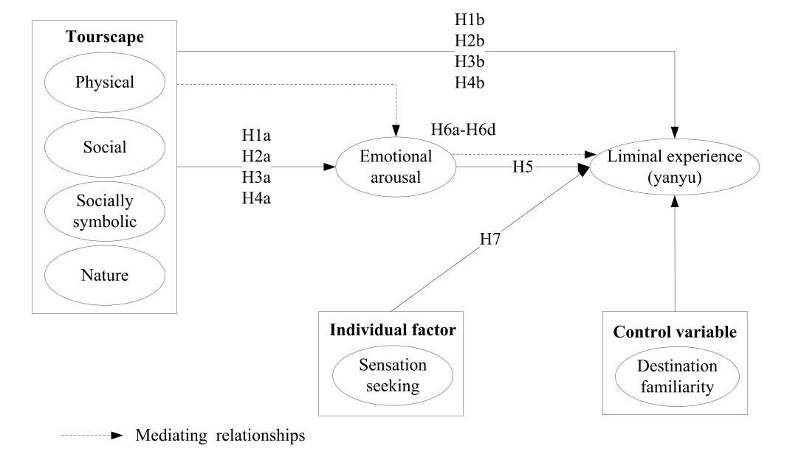

```{r setup, include=FALSE}
knitr::opts_chunk$set(
    echo      = FALSE,
    warning   = FALSE, 
    message   = FALSE,
    out.width = "85%",
    fig.asp   = 0.618,
    fig.align = 'center',
    fig.pos   = "H", 
    out.extra = "",
    dpi       = 600
)
options(digits = 3)
```

# Introduction

For a long time, China's society has been strongly influenced by the moral and intellectual codes of Confucianism. Chinese society is conservative in terms of gender relationships in daily life, but holidays are typically considered as a temporary escape from the daily norms of life as normal responsibilities are suspended[@Weichselbaumer2012]. This liminal transition phase has the "potential for an enriching experience in short, limited and constrained time periods that makes holidays so different from other pursuits", and in a liminal world, people can behave in a way as if they are free from constraints and obligations. Yanyu, a rising tourism phenomenon which originally meant a favorable opportunity for an encounter with a beautiful woman and which violates Chinese cultural beliefs, values and traditions, becomes acceptable and even natural in this liminal world[@ZHANG201984].

# Literature review

The term "liminal" was first developed by French folklorist Van Gennep for use in anthropology to describe the characteristics of rites in different stages of life; he divided the rites of passage into three stages Liminality is widely used in tourism contexts. In the tourism world, destinations serve as liminal spaces where tourists experience an anonymous environment and an evasion of social control, responsibility, and obligation.

Opportunities to encounter means that a tourist may meet strangers of the opposite gender in a Yanyu destination by chance, or in other words, Yanyu is something that may come with luck, and not by deliberately searching. Sense of loss refers to the feelings of depression and anxiety when two parties in a Yanyu relationship are separated from each other after traveling; and aberration means that tourists do something they would not do in everyday life because these things are incompatible with general social norms, but in a liminal space, these norms can be accepted. Still, not everyone dares to pursue a Yanyu experience, even when they are out of their daily lives.

# Hypothesis development

H1. Physical tourscapes positively influence: (a) emotional arousal and (b) liminal experience.

H2. Social tourscapes positively influence: (a) emotional arousal and (b) liminal experience.

H3. Socially symbolic tourscapes positively influence: (a) emotional arousal and (b) liminal experience.

H4. Natural tourscapes positively influence: (a) emotional arousal and (b) liminal experience.

H5. Emotional arousal positively influences liminal experience.

H6. Emotional arousal mediates the positive effects of: (a) physical (b) social (c) socially symbolic and (d) natural tourscapes on liminal experience.

H7. Sensation-seeking positively influences liminal experience.

To sum up, the hypotheses model is depicted in Fig \@ref(fig:fig-hypothesis).

```{r fig-hypothesis, fig.cap= "The hypothesis model."}

```

# Research methodology

Lijiang, located in northwestern Yunnan province, China, was chosen as the focus of this study for its high brand awareness and reputation as a Yanyu destination among Chinese people. Lijiang is a multi-ethnic community which includes Han, Naxi, Yi, Lisu, Pumi, Bai, Zang, and others. The Old Town of Lijiang is located in Lijiang City, which is a UNESCO Heritage Site. The data in Table \@ref(tab:tab01) indicate that among the 422 participants.

```{r tab01}
source("./code/Table01.R")
table01
```

# Results

The CFA results showed that the item (SY4, concentric lock) of a socially symbolic tourscape was lower than 0.5 (0.493), so this item was removed and a new CFA was conducted. Deleting this item is appropriate in that concentric lock is not as popular as in other socially symbolic tourscapes such as doodle drawings in Lijiang. As shown in Table \@ref(tab:tab02), all factor loadings were above 0.5.

```{r tab02}
source("./code/Table02.R")
table02
```

```{r tab03}
source("./code/Table03.R")
table03
```

```{r tab04}
source("./code/Table04.R")
table04
```

```{r tab05}
source("./code/Table05.R")
table05
```

```{r tab06}
source("./code/Table06.R")
table06
```

```{r tab07}
source("./code/Table07.R")
table07
```

```{r tab08}
source("./code/Table08.R")
table08
```

```{r tab09}
source("./code/Table09.R")
table09
```

```{r tab10}
source("./code/Table10.R")
table10
```

```{r tab11}
source("./code/Table11.R")
table11
```

# Conclusions, contributions and implications

This study takes two theoretical approaches to empirically in vestigate the factors influencing tourists' liminal experience at a Yanyu destination--Lijiang. The SOR theory is applied to examine the influences of a tourscape on tourists' emotional arousal and liminal experience, and then sensation seeking theory is used to investigate the effects of sensation-seeking on liminal experience.

The model should be further investigated and implemented with other more generic perspectives. First, in order to generalize the findings to a wider population, it would be worthwhile to expand this re-search to other Yanyu destinations such as Yangshuo and Fenghuang. Second, this study uses a quantitative method to empirically test the hypothesis model based on cross-sectional data, and future research could use qualitative methods to explore how the image of Yanyu has developed in the Chinese domestic market. Further, as liminal experience is a unique and complex phenomenon, future studies are needed to investigate other antecedents of liminal experience, such as tourist motivation, as well as consequences of liminal experience such as destination loyalty.

\newpage

# References {.unnumbered}
