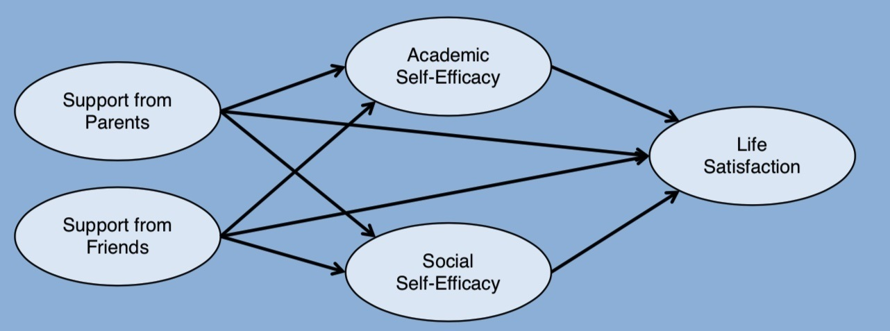
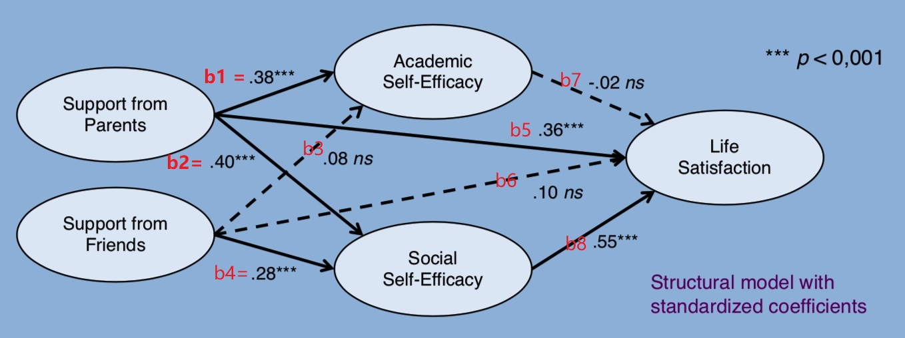

```{r setup, include=FALSE}
knitr::opts_chunk$set(
    echo     = FALSE,
    warning  = FALSE, 
    message  = FALSE,
    fig.asp  = 0.618,
    dpi      = 300
)
options(digits = 3)
```


```{r}
library(tidyverse)
library(lavaan)

d <- read_rds("data/data.rds") 
```

# 引言

青少年所经历的父母和朋友的情感支持对他们生活满意度的影响。父母的支持和朋友的支持都对生活满意度有积极影响。同时，“学术自我效能”和“社会自我效能”这两个自我效能将成为这些效应的中介。

```{r, out.width="100%"}

```


# 测量模型

```{r}
model_measurement <- "

# Measurement model
  SUP_Parents =~ sup_parents_p1 + sup_parents_p2 + sup_parents_p3
  SUP_Friends =~ sup_friends_p1 + sup_friends_p2 + sup_friends_p3
  SE_Academic =~ se_acad_p1 + se_acad_p2 + se_acad_p3
  SE_Social   =~ se_social_p1 + se_social_p2 + se_social_p3
  LS          =~ ls_p1 + ls_p2 + ls_p3
  
"

fit_cfa <- sem(model_measurement, data = d)
```


## 因子载荷
```{r}
fit_cfa %>%
  parameterEstimates(standardized = TRUE) %>%
  filter(op == "=~") %>%
  select(lhs, rhs, std.all) %>% 
  flextable::flextable() %>% 
  flextable::autofit() %>% 
  flextable::colformat_double(digits = 4)
```

结果显示，因子载荷都大于0.7，满足要求。


## 拟合指标
```{r}
index <- c(
    "chisq", "df", "pvalue", "cfi", "tli",
    "rmsea", "rmsea.ci.lower", "rmsea.ci.upper",
    "srmr", "aic", "bic"
  )

fit_cfa %>% 
 fitMeasures(
   fit.measures = index,
   output = "matrix" 
  ) %>% 
  as.data.frame() %>% 
  rownames_to_column() %>% 
  set_names(c("index", "value")) %>% 
  flextable::flextable() %>% 
  flextable::autofit() %>% 
  flextable::colformat_double(digits = 4)
```

结果显示 CFI = 0.938，TLI = 0.919在阈值线0.95/0.95左右，此外 RMSEA = 0.08，其90% 置信区间是[0.07; 0.09]，并不明显高于参考线0.1, 此外 SRMR = 0.06 也表明模型拟合的不错 (SRMR < 0.08)。


# 结构模型

```{r, out.width="100%"}

```


```{r}
model <- "
# Measurement model
  SUP_Parents =~ sup_parents_p1 + sup_parents_p2 + sup_parents_p3
  SUP_Friends =~ sup_friends_p1 + sup_friends_p2 + sup_friends_p3
  SE_Academic =~ se_acad_p1 + se_acad_p2 + se_acad_p3
  SE_Social   =~ se_social_p1 + se_social_p2 + se_social_p3
  LS          =~ ls_p1 + ls_p2 + ls_p3

# Regressions
  SE_Academic ~ b1*SUP_Parents + b3*SUP_Friends
  SE_Social   ~ b2*SUP_Parents + b4*SUP_Friends
  LS          ~ b5*SUP_Parents + b6*SUP_Friends + b7*SE_Academic + b8*SE_Social 

# Residual covariances
  SE_Academic ~~ SE_Social

# Indirect effects
  b1b7             := b1*b7
  b2b8             := b2*b8
  total_ind_parent := b1*b7 + b2*b8
  b3b7             := b3*b7
  b4b8             := b4*b8
  total_ind_friend := b3*b7 + b4*b8

# Total effects
  total_parent     := b1*b7 + b2*b8 + b5
  total_friend     := b3*b7 + b4*b8 + b6  
"

fit <- sem(model, data = d, se = "bootstrap")
```


# 结论
```{r}
vars <- c(str_c("b", 1:8), 
          "total_ind_parent", 
          "total_ind_friend", 
          "total_parent",
          "total_friend")

          
fit %>%  
  parameterEstimates(standardized = TRUE) %>%  
  filter(op %in% c("~", ":=")) %>% 
  filter(label %in% vars) %>% 
  select(-c(lhs, op, rhs, std.lv, std.nox)) %>% 
  arrange(factor(label, levels = vars)) %>%  
  flextable::flextable() %>%
  flextable::colformat_double(digits = 3) %>% 
  flextable::color(j = ~std.all, color = "red")
```


统计结果显示:

- （total_parent vs total_friend）父母的支持对年轻人的生活满意度最重要，父母支持是朋友支持的两倍多

- （b2*b8显著）父母的支持对年轻人的生活满意度，也通过社会自我效能产生间接效应

- .（b5，b6, b7 都不显著，只有b4*b8显著）朋友支持对生活满意度只有间接影响（通过社会自我效能感）

- （b7不显著，b8显著）学业自我效能与生活满意度关联性不大，社会自我效能感是生活满意度的最强预测因子

 
