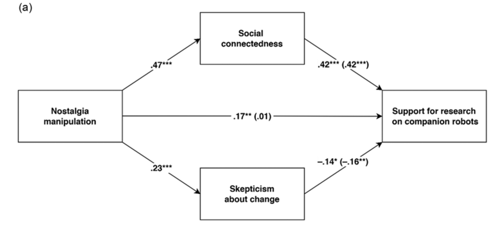

```{r setup, include=FALSE}
knitr::opts_chunk$set(
  echo       = FALSE,
  message    = FALSE,
  warning    = FALSE,
  out.width  = "100%",
  fig.asp    = 0.618, 
  fig.align  = "center",
  fig.pos    = "H", 
  out.extra = "",
  # fig.show   = "hold",
  # fig.pos    = "center",
  dpi        = 600
)

options(
  digits = 3,
  knitr.table.format = "html"
)
```


# Introduction

We had two objectives in experimental Study 4. To begin, in Studies 2 and 3, although we obtained results consistent with the hypothesized model, we assessed responses to general innovative technology rather than specific products. Here, we assessed responses to a specific AI product, companion robots, operationalized both attitudinally (i.e., support for research on companion robots) and behaviorally (i.e., adoption of companion robots). There is another reason, besides generality, that we opted for companion robots. In Studies 2 and 3, the opposing pathways via, respectively, social connectedness and skepticism about change, did not differ significantly in strength. It is possible, however, that the results of Studies 2 and 3 were due to the AI products being orthogonal to sociality. Does the balance shift in favor of the social connectedness pathway (relative to the skepticism pathway) when AI is imbued with sociality, as companion robots are? Indeed, such robots are designed to appear human-like and communicate as humans do; as a result, they are anthropomorphized. Although anthropomorphism has generally been linked not only to approach[@Weichselbaumer2012] but also to avoidance[@Ryan1996] of innovative technology, robot anthropomorphism in particular elicits trust and acceptance.


# Method

## Participants
We implemented the web-based Monte Carlo power analysis app[@Ryan1996] to estimate the sample size required to observe an indirect effect of manipulated nostalgia on attitudes (and behavior) toward technological innovation via social connectedness and an indirect effect via skepticism about change.


## Procedure and Materials
*Nostalgia Manipulation.* In the first task (pictorial induction), we presented participants in the nostalgia condition with 20 pictures of nostalgic objects (e.g., marbles, Tetris game) and those in the control condition with 20 pictures of neutral objects (e.g., window,
toothbrush).

*Social Connectedness.* We measured this variable with the four items that we used in Study 3.

*Skepticism About Change.* We measured this variable with
the same four items as in Study 3.

*Support for Research on Companion Robots.* We measured
this variable with three items. We averaged responses to create an index of support for research on companion robots, with higher values indicating more support.

*Adoption of Companion Robots.* We presented participants with six contexts wherein either companion robots or real pets could be used[@Weichselbaumer2012].


# Results and Discussion

```{r}
library(tidyverse)

rawdat <- haven::read_sav("data/Study 4/Study 4.sav")

d <- rawdat %>% 
  rowwise() %>% 
  mutate(
    Nostalgia      = mean(c_across(starts_with("NOS"))),
    Skepticism     = mean(c_across(starts_with("SKEP"))),
    Social_connect = mean(c_across(starts_with("SCN"))),
    Support_robot  = mean(c_across(starts_with("SUPPORT"))),
    Adoption_robot = sum(c_across(starts_with("ADOPT"))),
  ) %>% 
    ungroup() %>% 
    select(Mnos, Nostalgia, Social_connect, Skepticism, Support_robot, Adoption_robot)
```


## Descriptive Statistical Analysis
We report descriptive statistics in Table \@ref(tab:tab-descriptive)

```{r, tab.id="tab-descriptive", tab.cap="Desccriptive Statistical Analysis."}
# "Nostalgia", "Social_connect", "Skepticism", "Support_robot", "Adoption_robot"

levels <- c("Nostalgia", "Social_connect", "Skepticism", "Support_robot", "Adoption_robot")

d %>% 
  group_by(Mnos) %>% 
  summarise(
    across(everything(), list(M = mean, SD = sd))
  ) %>% 
  pivot_longer(
    -Mnos,
    names_to = c("Variable", ".value"),
    names_pattern = "(.*)_(M|SD)"
  ) %>% 
  arrange(Variabel = factor(Variable, levels = levels)) %>% 
  flextable::flextable() %>% 
  flextable::autofit()
```


## Pearson Correlation Analysis
We report descriptive statistics in Table \@ref(tab:tab-correlation)

```{r, tab.id="tab-correlation", tab.cap="Pearson Correlation Analysis."}
d %>% 
  select(-Nostalgia) %>% 
  summarise(
    across(everything(), list(M = mean, SD = sd)) 
  ) %>% 
  pivot_longer(
    everything(),
    names_to = c("Variable", ".value"),
    names_pattern = "(.*)_(M|SD)"
  ) %>% 
  left_join(
    d %>% 
      select(-Nostalgia) %>% 
      corrr::correlate() %>% 
      corrr::shave(upper = F),
    by = join_by("Variable" == term)
  ) %>% 
  set_names("Variable", "M", "SD", "1", "2", "3", "4", "5") %>% 
  flextable::flextable() %>% 
  flextable::colformat_double(digits = 2) %>% 
  flextable::autofit()
```

\newpage

## Mediation Analysis

### Support for Research on Companion Robots

To sum up, the hypotheses model is depicted in Fig \@ref(fig:fig-5a).

```{r fig-5a, fig.cap="Support for Research on Companion Robots"}

```


```{r}
library(lavaan)

model <- '
  Social_connect ~ a1*Mnos
  Skepticism     ~ a2*Mnos
  Support_robot  ~ b1*Social_connect + b2*Skepticism + cprime*Mnos
'

fit_a <- sem(
  model = model,
  data = d,
  estimator = "MLR",
  mimic = "Mplus"
)
```


We report statistics in Table \@ref(tab:tab-medA)
```{r, tab.id="tab-medA", tab.cap="Support for Research on Companion Robots."}
fit_a %>% 
  parameterEstimates(standardized = T) %>% 
  filter(op == "~") %>% 
  select(label, est, se, pvalue, ci.lower, ci.upper, std.all) %>% 
  flextable::flextable() %>% 
  flextable::colformat_double(digits = 2) %>% 
  flextable::color(j = "std.all", color = "red") %>% 
  flextable::autofit()
```

\newpage

### Adoption of Companion Robots

To sum up, the hypotheses model is depicted in Fig \@ref(fig:fig-5b).

```{r fig-5b, fig.cap="Adoption of Companion Robots"}

```


```{r}
model <- '
  Social_connect ~ a1*Mnos
  Skepticism     ~ a2*Mnos
  Adoption_robot ~ b1*Social_connect + b2*Skepticism + cprime*Mnos
'

fit_b <- sem(
  model = model,
  data = d,
  estimator = "MLR",
  mimic = "Mplus"
)
```


We report statistics in Table \@ref(tab:tab-medB)
```{r, tab.id="tab-medB", tab.cap="Adoption of Companion Robots."}
fit_b %>% 
  parameterEstimates(standardized = T) %>% 
  filter(op == "~") %>% 
  select(label, est, se, pvalue, ci.lower, ci.upper, std.all) %>% 
  flextable::flextable() %>% 
  flextable::colformat_double(digits = 2) %>% 
  flextable::color(j = "std.all", color = "red") %>% 
  flextable::autofit()
```

\newpage

# General Discussion

We addressed the relation between nostalgia and responses to innovative technology. How does nostalgia, a past-oriented but also forward-looking emotion, influence responses to new technology? Is nostalgia an obstacle to progress or a vehicle for it? It turns out it is both. We proposed a dual-pathway model that captures the duality of nostalgia (Figure 1). According to this model, nostalgia decreases the favorability of responses to innovative technology via increased skepticism about change. At the same time, nostalgia promotes the favorability of responses to innovative technology via increased social connectedness. In this regard, the dual-pathway model not only reconciles two seemingly competing perspectives, but also provides a novel framework to understand how yearning for the past influences the endorsement of technological progress.

## Theoretical Implications
Nostalgia decreases favorable responses to innovative technology via skepticism about change, consistent with findings that nostalgia entails a preference for the past[@Ryan1996] and can be a barrier to accepting innovation[@Weichselbaumer2012].


## Practical Implications
Our research has practical implications as well. To begin, it informs strategies for overcoming psychological barriers to innovative technology. Considering the commercial potential, convenience, and well-being afforded by innovation, a sizable literature has examined how to strengthen favorability of responses to innovative technology. Prior work focused on two promising directions[@Ryan1996]. 


# Limitations and Future Directions

Limitations of our research can inspire follow-ups. First, the relative strength of the two opposing mechanisms (skepticism about change and social connectedness) needs further investigation. When linking nostalgia to support for AI products that entail sociality (Study 4), the excitatory pathway via social connectedness was stronger than the inhibitory pathway via skepticism about change. When linking nostalgia to responses to AI products without explicit social cues (Studies 2 and 3), however, the excitatory pathway via social connectedness did not differ significantly from the inhibitory pathway via skepticism about change. Therefore, a promising line of research would involve testing systematically whether the relative strength of two pathways varies depending on whether AI products entail social connectedness. 


\newpage
# References {.unnumbered}