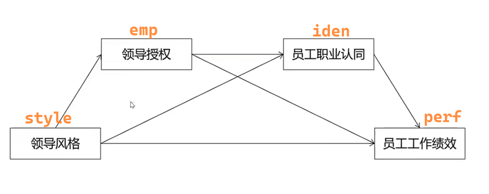
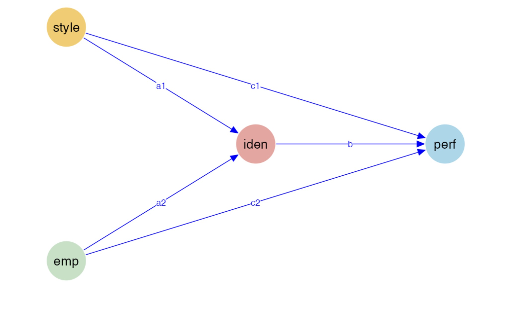
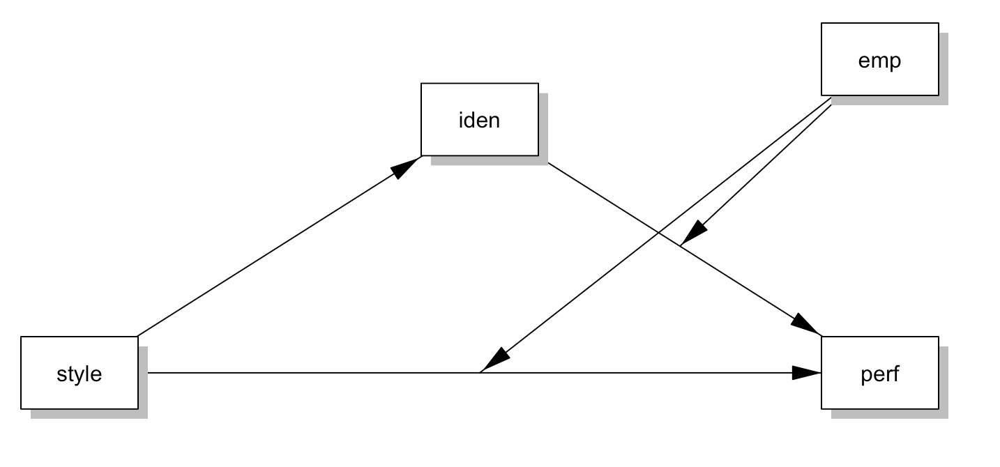

```{r setup, include=FALSE}
knitr::opts_chunk$set(
    echo         = FALSE,
    warning      = FALSE, 
    message      = FALSE,
    fig.align    = "center", 
    out.width    = "80%",
    fig.width    = 5, 
    fig.asp      = 0.618,
    dev          = "ragg_png",
    dpi          = 300, 
    fig.show     = "hold",
    fig.showtext = TRUE,
    fig.pos      = "H"
)
```


# 数据

```{r}
library(tidyverse)
d <- haven::read_sav("./data/data.sav")  

#d %>% sjPlot::view_df()
```
  

```{r}
tibble(item = colnames(d)) %>% 
  mutate(
    variable = case_when(
      str_detect(item, "style") ~ "领导风格",
      str_detect(item, "emp")   ~ "领导授权",
      str_detect(item, "iden")  ~ "身份认同",
      str_detect(item, "perf")  ~ "员工工作绩效"
    ),
    .before = 1L
  ) %>% 
  knitr::kable(
    "latex",
    booktabs = TRUE,
    align = "ll",
    linesep = ""
  ) %>%
  kableExtra::column_spec(1, bold = T, width = "15em") %>%
  kableExtra::column_spec(2, width = "10em") %>%
  kableExtra::collapse_rows(
    columns = 1,
    valign = "top",
    latex_hline = "none"
  ) %>%
  kableExtra::kable_styling(
    latex_options = c("HOLD_position"),
    position      = "center"
  )
```


# 模型

在文献调研的基础上，建立以上四个变量的结构方程模型，并用数据加以验证。


  
# 要求

可独立参赛，也可自由组队（不超过5个人），于2024年07月24日在\textcolor{OrangeRed}{NCU-R-Workshop}上分享研究结果，内容需要包括

- 题目
- 摘要
- 模型构建及理论依据
- 实证结果及图表展示
- 参考文献

\newpage

# 请教魏教授

大家返回了至少三种模型，请问哪一种最有可能是正确的，或者最有可能写出文章来？

- model 1 
```{r}

```

- model 2
```{r}

```

\newpage
- model 3
```{r}

```
