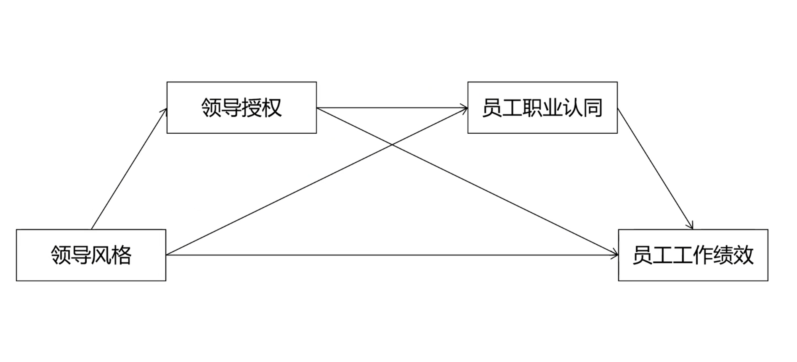

```{r setup, include=FALSE}
knitr::opts_chunk$set(
    echo     = FALSE,
    warning  = FALSE, 
    message  = FALSE,
    fig.asp  = 0.618,
    dpi      = 600
)
options(digits = 3)
```

Previous studies have indicated that parent–child relationship as well as learning motivation and academic self-efficacy is an influential factor of learning engagement, but the impact mechanism of the relevant factors needs to be explored. The purpose of the current study is to investigate how parent–child relationship is related to learning engagement via the mediating roles of learning motivation and academic self-efficacy. Structural equation modeling (SEM) was adopted for the analysis of 280 participants from China. Results showed that parent–child relationship was directly correlated with adolescents’ learning engagement. Results also showed that parent–child relationship indirectly predicted adolescents’ learning engagement via learning motivation and academic self-efficacy respectively and sequentially. More importantly, it was revealed that the direct effect was much lower than the total indirect effects which include the indirect effect of learning motivation, the indirect effect of academic self-efficacy, and the indirect effect of learning motivation and academic self-efficacy. Among the three indirect effects, the indirect effect of learning motivation and academic self-efficacy was the greatest. Major findings were discussed with implications and limitations in the study.


# Introduction

Parent–child relationship is defined as a kind of unique and influential relationship established in the process of interaction between parents and their children, which is critical to adolescents’ physical and mental development[@Malczyk2017].

Based on this theory, a theoretical model has been constructed to test the link between parent–child relationship and learning engagement, as well as the mediating roles of learning motivation and academic self-efficacy (shown in Figure \@ref(fig:fig-hypothesis) ).

```{r fig-hypothesis, fig.cap = "The proposed theoretical model."}

```


## Parent–Child Relationship and Learning Engagement
Parent–child relationship plays a crucial role in adolescents’ emotional, cognitive, and behavioral development[@Chang2007].

H1. Parent–child relationship is positively related to learning engagement.


## Learning Motivation as a Mediator
Learning motivation is a complex overarching concept, which is influenced by a set of psychosocial factors both internal and external (presented in the learner’s social and natural environment) to the learner.

H2: Parent–child relationship is positively related to learning motivation.

H3: Learning motivation is positively related to learning engagement.

H4: Learning motivation may play a mediating role in the link between parent–child relationship and learning engagement.


## Academic Self-Efficacy as a Mediator

Self-efficacy (SE) is defined as “an individual belief in one’s capabilities to organize and execute the courses of action required in producing given attainments”

H5: Parent–child relationship is positively related to academic self-efficacy.

H6: Learning motivation is positively related to academic self-efficacy.

H7: Academic self-efficacy is positively related to learning engagement.

H8: Academic self-efficacy plays a mediating role in the link between parent–child relationship and learning engagement.

H9: Learning motivation and academic self-efficacy play a chain mediating role in the link between parent–child relationship and learning engagement.


# MATERIALS AND METHODS

## Sampling and Data Collection
This is primarily quantitative research with survey as the main research strategy. Questionnaire was used as a data collection instrument or tool. The analysis of this research was based on correlation, regression and structural equation modeling (SEM) technique. To test the mediating role of organizational readiness, Preacher and Hayes’s (2004, 2008) approach was utilized with 5000 bootstrap.

## Questionnaire Design

The questionnaire was designed based on previous instruments with acceptable reliability and validity. It consisted of two main sections. The first section intended to measure the demographic characteristics of the respondents, including gender, grade, and place of residence in Table \@ref(tab:tab1).

```{r, tab.id = "tab1", tab.cap = "Latent variables and items"}
library(dplyr)
tb <- readxl::read_excel("./data/items.xlsx")

tb %>%    
  flextable::flextable() %>%  
  flextable::autofit() %>% 
  flextable::width(j = 1:3, width = c(1.5, 1, 4)) 
```

## Statistical Analysis

The data were analyzed with structural equation modeling (SEM) in SPSS 24.0 and Amos 24.0. First, confirmatory factor analysis (CFA) was performed to measure the model fit of each construct. Second, the reliability and validity of each scale were tested by providing the values of standardized factor load, CR, and AVE. Third, the multiple path coefficients were analyzed to confirm the hypotheses. Fourth, the method of maximum likelihood estimation was adopted to test the structural model. Fifth, the bootstrap method was used to examine the indirect effect of parent–child relationship on learning engagement.


# Results

## Confirmatory Factor Analysis
The results supported that validity and reliability of the scales is not an issue. Both convergent and discriminant validity shows scales were valid. Results of convergent validity were satisfactory, i.e. factor as loading >0.70 and AVE > 0.50. Discriminant validity was also confirmed as AVE was greater than shared variance constructs with every other constructs. CR was >0.60, and α (Cronbach’s alpha) was >0.70. 

```{r}
source("./code/Table01.R")
table01
```

## Measurement Model
The measurement model was assessed by testing its reliability and validity. The value of Cronbach’s α ranges from 0.80 to 0.89, indicating that the model has good reliability. Results are presented in Table \@ref(tab:tab2).

```{r, tab.id = "tab2"}
source("./code/Table02.R")
table02
```

As shown in Table 3, the values of Cronbach’s α ranged from 0.837 to 0.883. The values of the factor loadings were between 0.603 and 0.897. The CR and AVE values of each latent construct in Table \@ref(tab:tab3).

```{r, tab.id = "tab3"}
source("./code/Table03.R")
table03
```


## Structural Model

In the study, the method of maximum likelihood estimation was used to assess the structural model with Amos 24.0. Zhang et al. (2020) have demonstrated a good-fitting structural model needs to meet the following conditions. Results are presented in Table \@ref(tab:tab4).

```{r, tab.id = "tab4"}
source("./code/Table04.R")
table04
```

The structural modeling diagram in Figure \@ref(fig:fig-sem) indicates the path coefficients and explanatory variance of the structural model with standardized parameter estimates. The construct of Parent–child Relationship explained 16% of the variance in the construct of Learning Motivation, corresponding to a standardized regression coefficient of 0.400. 

```{r fig-sem, fig.cap= "The structural modeling diagram.", fig.width= 6}
source("./code/Figure02.R")
```

## Hypotheses Tested
As seen in Table \@ref(tab:tab5), parent–child relationship and learning engagement established significant and positive relationships

```{r, tab.id = "tab5"}
source("./code/Table05.R")
table05
```


learning engagement and played partial mediating roles. And H4, H8, and H9 were also supported. In addition, the effect percentage showed that the direct effect of parent– child relationship on learning engagement explained 36.5%, while the indirect effect of parent–child relationship on learning engagement accounted for 63.5%, much greater than that of the direct effect. Among the three indirect effects, the indirect effect from parent–child relationship to learning engagement via learning motivation and academic self-efficacy was the greatest.


# Discussion and conclusion

The child relationship and learning engagement. In parallel, it also attempted to explore the mediating roles of learning motivation and academic self-efficacy in that link. The major findings are as follows.

The results of the study showed that parent–child relationship was directly related to learning engagement, which is consistent with prior studies, that is, students with better parent–child relationship are more likely to engage themselves more in learning. One possible reason is that good parent–child interaction makes adolescents feel warm and loved, and promote their mental health, which is beneficial to adolescents’ devotion to learning. The results of this study further highlighted that parent–child relationship is an influential factor of learning engagement[@XuHonggang2016].


\newpage
# References {.unnumbered}